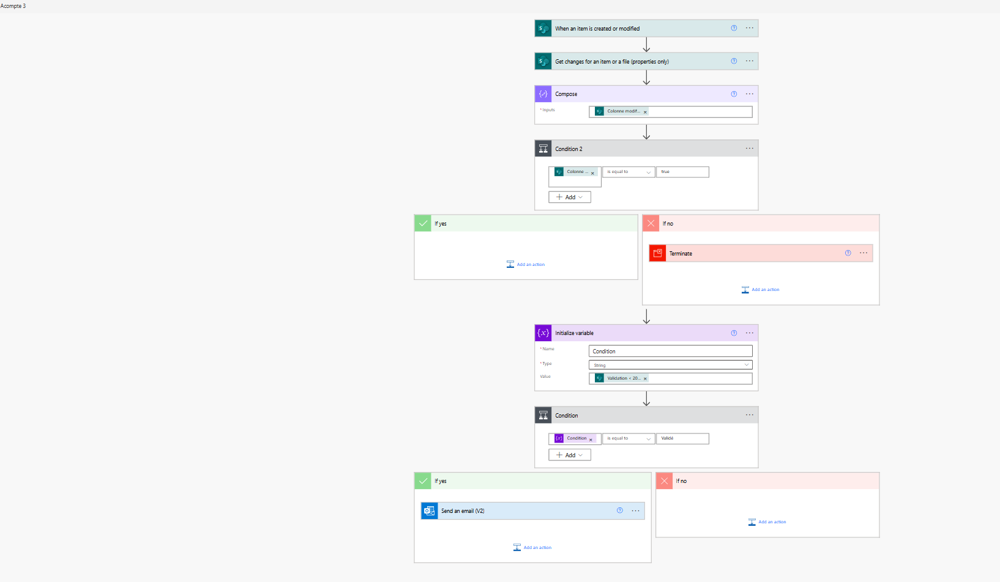
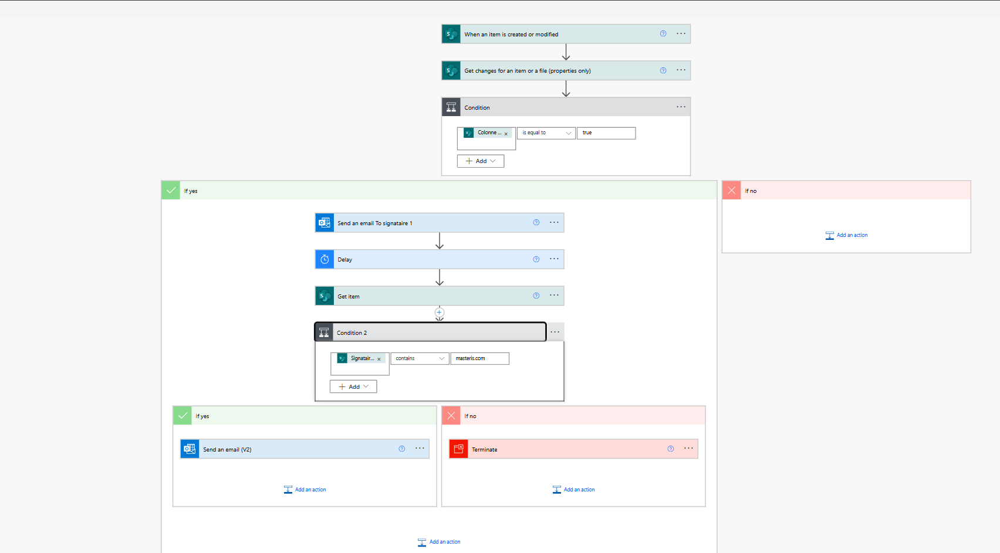
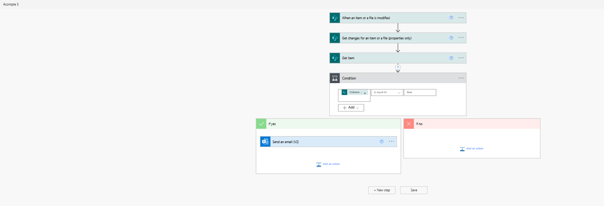
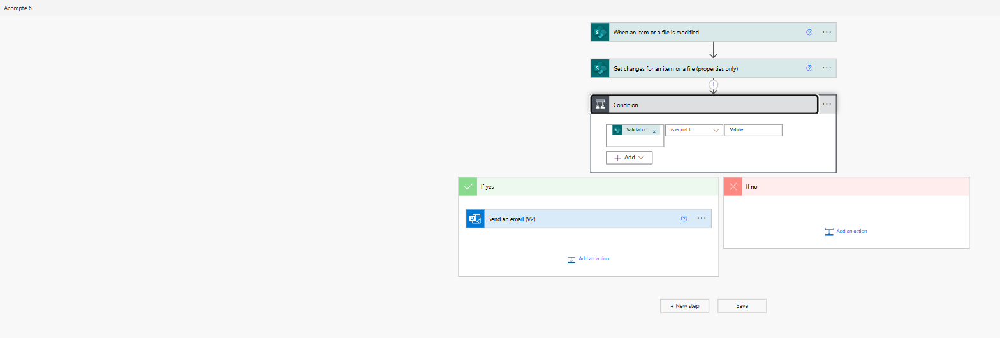
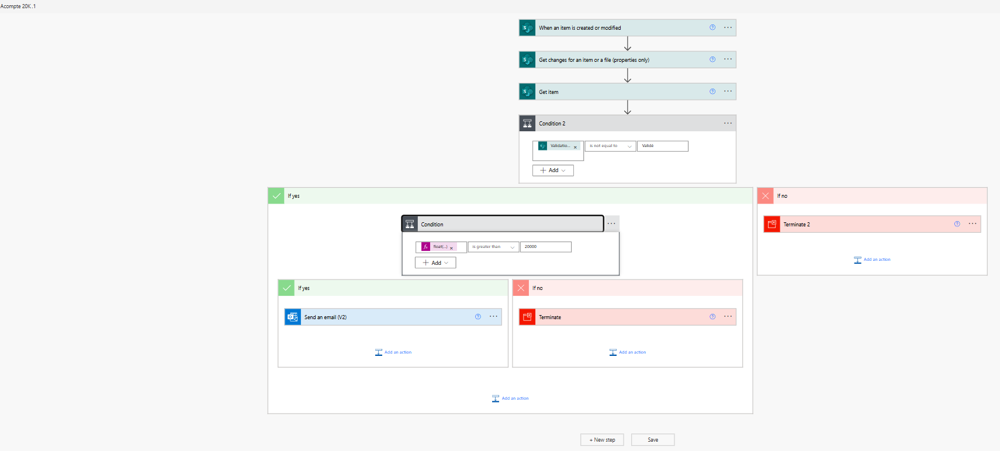
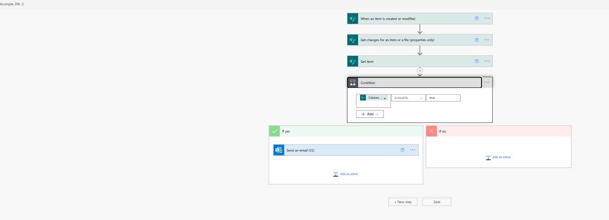

# 💼 Power Automate Portfolio – Mounir Bekkaoui
Bienvenue sur mon portfolio de projets réalisés avec **Microsoft Power Automate**. Ce dépôt présente différents cas d’usage concrets d’automatisation de processus métier avec captures d’écran, explications techniques, et résultats obtenus.

---

## 📂 Projets disponibles
### 🔹 [Projet 1 – Demande d’acompte d’achat](projet-acompte/README.md)
**Objectif :** Automatiser les demandes d’acompte via Forms, SharePoint et Teams.

- ⏱ Réduction du temps de traitement de 80 %
- 🧩 Technologies : Power Automate, Forms, SharePoint, Teams
- ## 📸 Captures d’écran du flux

Voici les étapes illustrées du flux :

