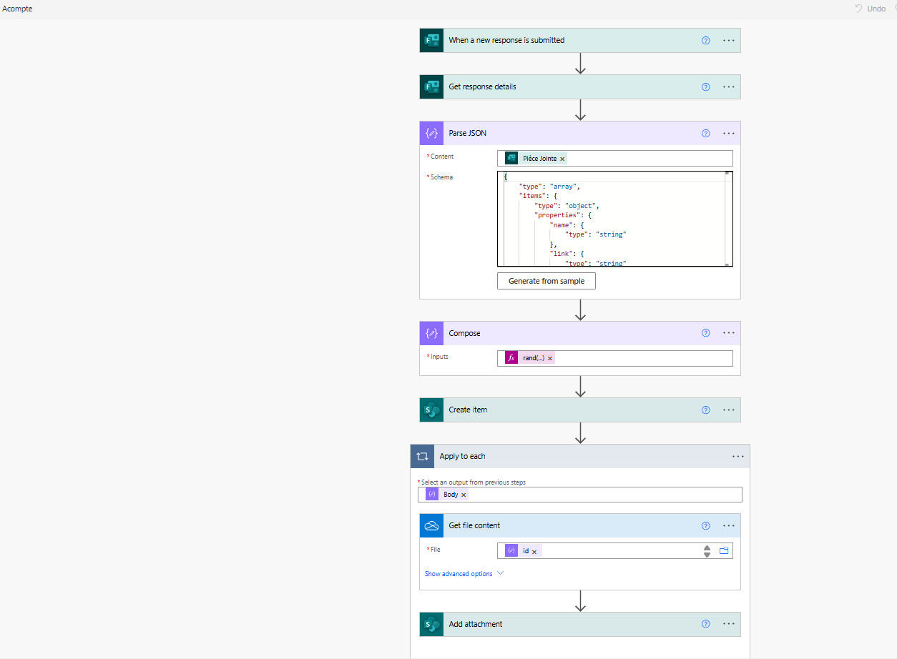
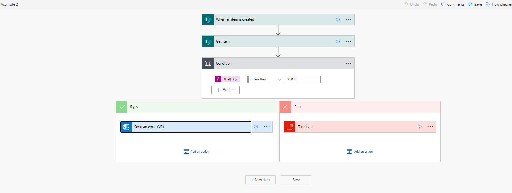
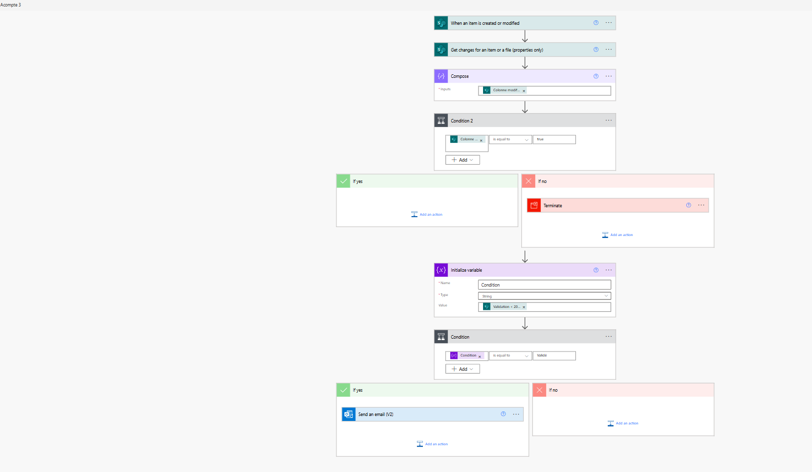
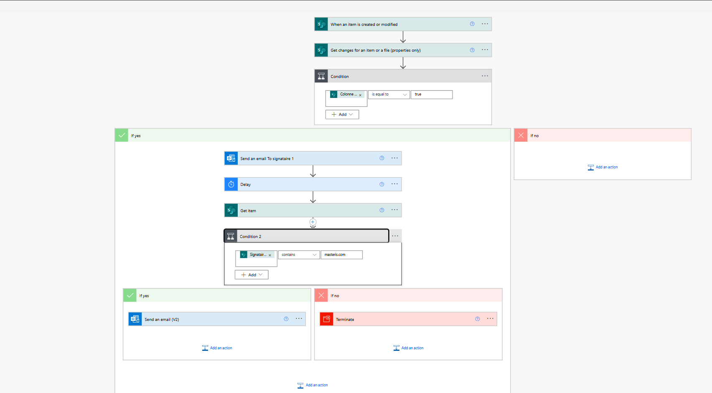
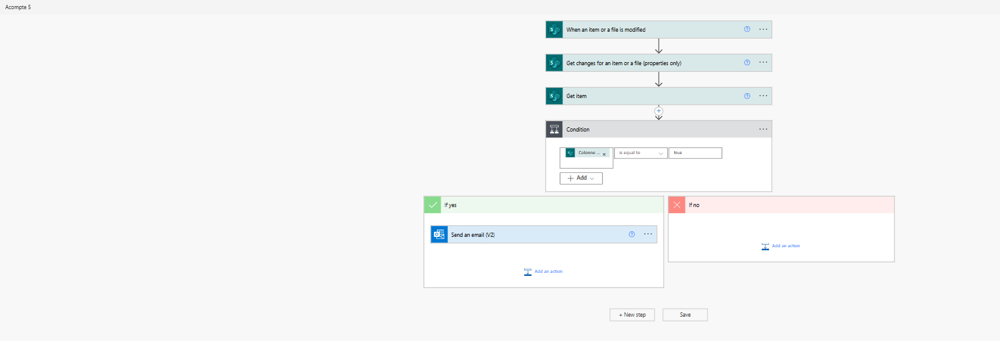
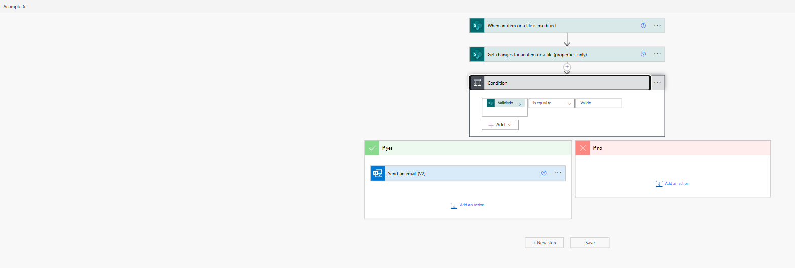
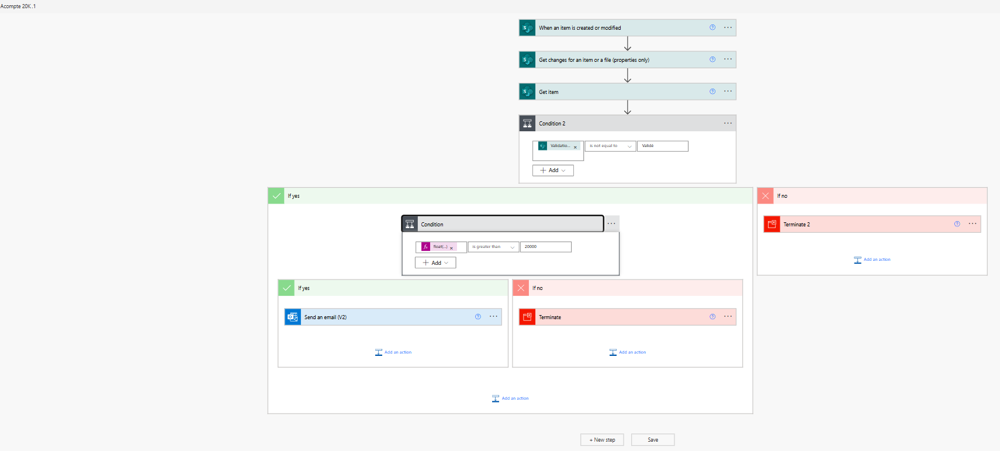
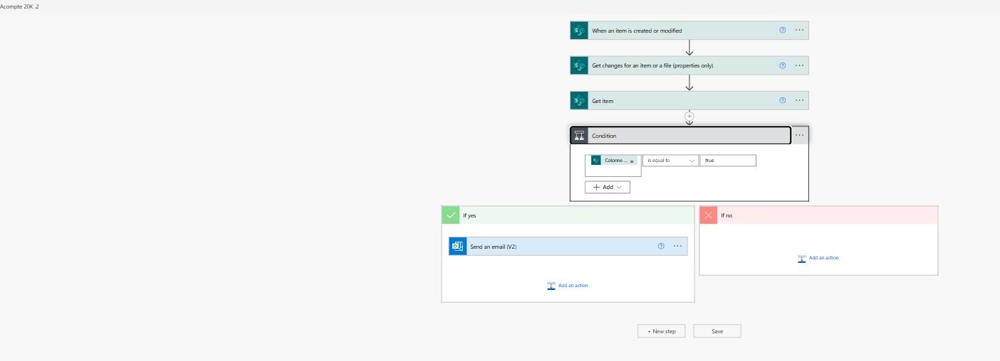

📁 Projet 1 – Demande d’Acompte

🎯 Objectif  
Automatiser le processus de demande d’acompte afin de faciliter la validation par les services comptables et garantir un meilleur suivi.

⚙️ Fonctions couvertes  

📝 Saisie de la demande  
- Formulaire Microsoft Forms rempli par l'utilisateur  
- Enregistrement automatique des données dans une liste SharePoint

🔔 Validation hiérarchique  
- Demande de validation envoyée automatiquement via Teams ou Outlook  
- Condition de seuil possible pour acheminement vers un valideur supérieur  
- Mise à jour de l’état de validation dans la liste SharePoint

📩 Notification automatique  
- Envoi d’un e-mail de confirmation ou refus au demandeur  
- Archivage de la décision dans SharePoint avec date et horodatage

🧩 Technologies utilisées  
Power Automate  
Microsoft Forms  
SharePoint  
Teams / Outlook (approbations)

## 📸 Captures d’écran du flux

Voici les étapes illustrées du flux :

  
  
  
  
  
  
  

