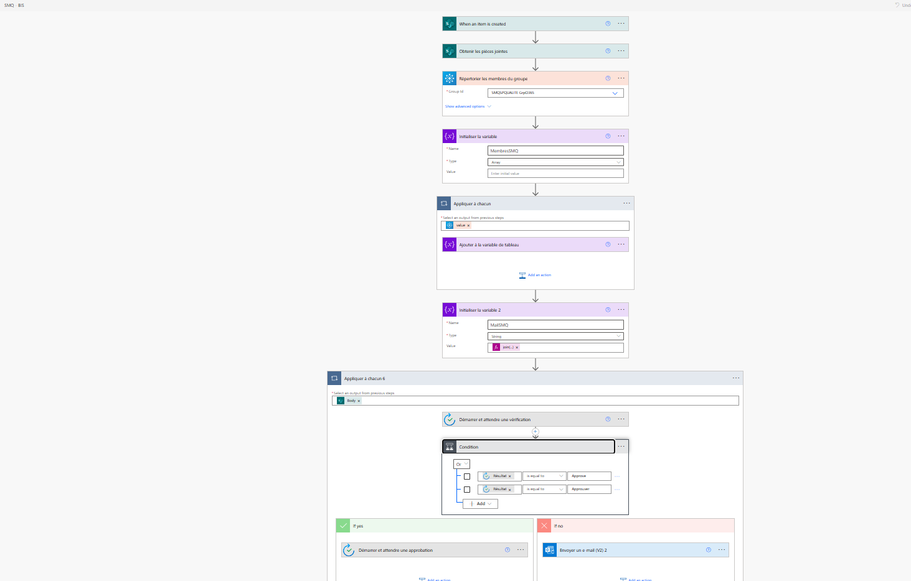
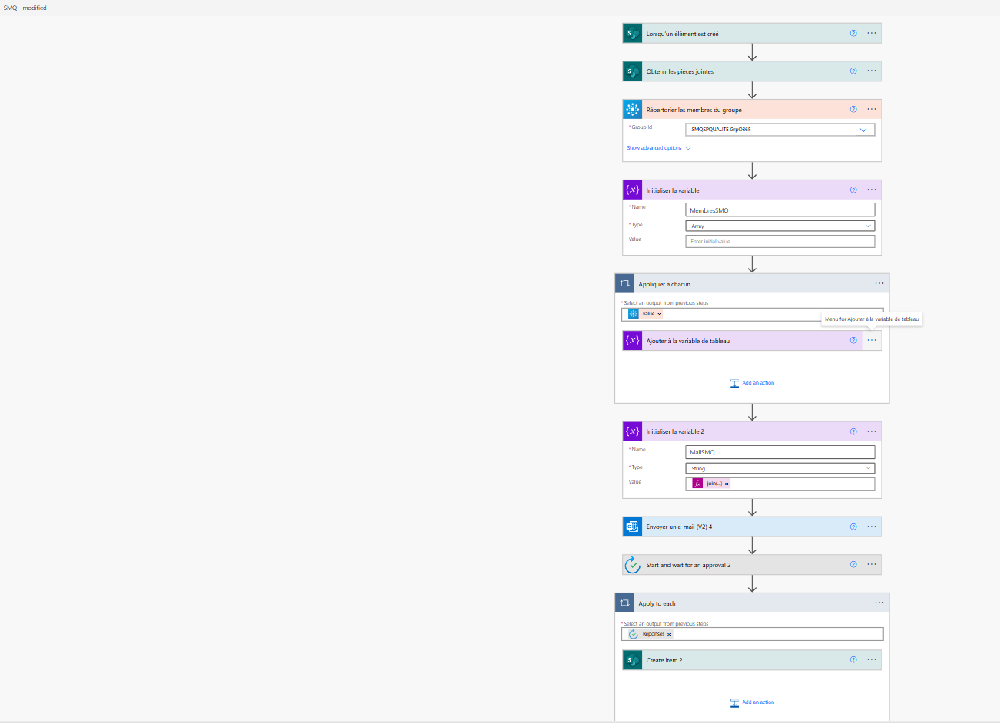

# 📁 Projet 3 – Gestion des Informations Documentées (Qualité)

## 🎯 Objectif
Automatiser la gestion des informations documentées, de leur diffusion à leur validation, avec relances et suivi.

---

## ⚙️ Fonctions couvertes

- 📤 **Diffusion**
  - Création de listes de diffusion par service (RH, Compta, SI, etc.)
  - Envoi automatique d’une demande de lecture par mail
  - Collecte d’accusés de lecture dans un tableau SharePoint
  - Relances automatiques hebdomadaires jusqu’à lecture confirmée

- ✅ **Cycle Vérificateur / Approbateur**
  - Notifications pour validation ou refus par le vérificateur
  - Puis notification à l’approbateur
  - Enregistrement des statuts et dates dans un tableau SharePoint
  - Notification finale au service Qualité

- ⏳ **Suivi des documents expirants**
  - Détection des documents expirant dans 3 mois ou déjà échus
  - Notification au service QSSE + relance hebdomadaire au pilote de processus
  - Suivi des prolongations ou refus
  - Visualisation des statuts (vérificateur, approbateur, validité) directement sur SharePoint

---

## 🧩 Technologies utilisées

- Power Automate  
- SharePoint
- Teams/Approvals
- Outlook (envois/relances mail automatiques)  
  
---

## 📸 Captures d’écran du flux

Voici les étapes illustrées du processus :

- 
- 
---

## 📈 Résultats attendus

- Gain de temps administratif
- Amélioration de la traçabilité documentaire
- Suivi centralisé des vérifications, approbations et lectures
- Moins d’oublis grâce aux relances automatiques

